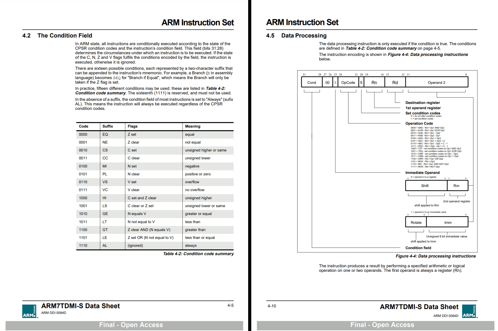

<html>
<body>
  Conditional code, and condition Flags: <a href="#cond">Link</a> 
  Functions, Interrupts (Stack memory): <a href="#func">Link</a> 
  Loops, and repeat <a href="#loops">Link</a> 
  Array's, and data structure: <a href="#data">Link</a> 
  Complications, and Conclusion: <a href="#end">Link</a>
  
    

  <h1>Pre compiled binary.</h1>
  
  A Pre compiled binary runs on a eco system of processors that are the same architecture type.

    
  
  This is how Windows, DOS, Unix, Linux, and macOS work.

    
  
  The loader for the application is design to dump the pre compiled binary into RAM.

    
  
  The CPU is meant to directly run the program instructions without recompiling the code.

    
  
  The systems are originally designed to target x86 cores.

    
  
  This meant mostly AMD, Intel cores, and some off brand x86 cores that run x86 instructions.

    

  You can learn some of the basics of machine code, and processor architecture the following <a href="https://recoskie.github.io/JFH-Disassembly/docs/Machine.html">link</a>.
  
  <h1>Dynamically generated code.</h1>
  
  Such as Java, Scripting languages, emulators (JIT/Interpreter).

    
  
  These forums of code store instructions stored in the file that are not understood by the CPU directly.

    
  
  In java it is called <strong>java byte codes</strong>. As loading a new part in a APP, or game takes more time than a pre compiled code.

    
  
  The advantage of this is that you can change the byte code commands into different processor instructions.

    
  
  The main binary that does all the work is called a JIT compiler, or interpreter.

    
  
  The JIT compiler, or interpreter is built in pre compiled binary code to make it run fast on the target architecture type.

    
  
  However, if you use the JIT compiler, or interpreter as the base of your operating system for loading applications. That is dumb, and bit slower on performance.

    
  
  These are your android systems, and SUN micro systems OS (Solar OS).

    

  Cases in which dynamically generated code speeds stuff up is.

  
 

  Dynamically generated AI (Artificial intelligence) code. This is somewhat different as it takes information in to generate changes to itself.
  
    

  There is also self modifying code that can make modifications to itself to save time in algorithms and loops.

  <h1>Data types.</h1>

  The raw arithmetic types such as Integers numbers, floating point, text data. Do not change between CPU architecture types.

    

  The data types for <strong>data processing</strong>, and doing math arithmetic, and text are standardized.

    

  Also everything is in bytes. Thus numbers are in different word sizes using bytes.

    

  You can learn about them following: <a href="https://recoskie.github.io/JFH-Disassembly/docs/Basics.html#dTypes">link</a>.

    

  The most java has to do is compile the programs instructions into instructions the target CPU architecture uses.

    

  The processor should be able to process the standard primitive data types.

   

  <h1>Translating to code.</h1>

  The steps you put into code are the same septs wrote out in machine code. It just is a little harder to follow.

    

  What will change is you will see it moves a number into a register and adds it with the value. Writes it back to memory at the location of your variable.

    

  The first thing that will be noticeably missing is the names of your data types.

    

  So when you see add, and subtracts, and other operations that you would normally do in code.

    

  You give them temporary variable names. Until you know what they ware intended for in the steps of the code.

    

  You also have to pick a language syntax that you are comfortable with. Such as <strong>JavaScript, or C</strong>.

    

  As you define what the steps are doing. It rally does not matter which language you target to write the steps back out in.

    

  You also should be able to distinguish some of the basic built in methods in a programming language.
  
    
  
  If you see a number being divided by 10 till no remainder. Then you know it is the <strong>toString</strong> method. Which converts the number to a base 10 number.
  
    
  
  Uses graphics to draw the character values using the standard text format. However, you could just write out the full logic of the code.

    

  It will still compile back out fine. However, it makes it easier to read if you recognize the built in methods.

  <h1 id="cond">Arithmetic comparison.</h1>
  
  Normally in programming languages. You can compare things in a single line of code. However, comparison is done using arithmetic logic.
  
    

  All CPU's have to do it in a few steps regardless of the CPU type.
  
    

  An processors arithmetic unit has outputs zero, sing, carry, overflow. So do calculators.
  
    

  These outputs are saved into a flag register from the arithmetic circuit per every arithmetic instruction.

    
  
  A simple ALU design is that of the 74181 which started the design of single chip CPU's. Following: <a href="https://en.wikipedia.org/wiki/74181">link</a>.

    

  All processors today have very small ALU which is designed to do all arithmetic operations. The small size is achieved by having the S inputs change the logical combination input to output.

    

  Thus you need to know the right values to set the S inputs to generate the right logical combination between input to output to do a ADD, or subtract.

    

  The pin that is A = B is the zero flag from the 74181, and P is parity meaning output is odd or even.

    

  We also have carry as a pin output. The sing is just a straight connection from the last output. Modern ALU's are 8 in size today. Thus are grouped together in word sizes.
  
    

  A CPU like a x86 one. Will have a compare instruction. The compare instruction does a subtract between two numbers without writing the result.
  
    

  We could use subtract instead on any CPU, but using compare is better if you do not wish for the value to be subtracted and only want to compare.
  
    

  Now the zero output is set when the output is all 0 from any arithmetic operation. Which is just a <strong>inverter</strong> with an <strong>and gate</strong> at the output.
  
    
  
  This means both values are the same such as 7489328 - 7489328 = 0. Which sets zero to active in the flag register.
  
    

  If the value being subtracted was smaller. The last binary digit would be borrowed causing the last binary digit to be set.
  
    

  This sets "sing = 1" as in negative value. If the value was grater than "sing = 0".
  
    

  Comparing the flags after subtract, or compare allows us to create <strong>less than, grater than, equal to, or less than equal to, and grater than equals to</strong>.
  
    

  This is the regular way comparison is done arithmetically by all CPU's.
  
    
  
  <strong>The programmer is not use to having to compare something first then do a conditional jump.</strong>
  
    

  A processor jump in a x86 core will only jump to the location if the flags are set to the right value after a compare, subtract, or any arithmetic instruction.
  
    

  Otherwise the instructions after the jump will run.
  
    
  
  On an ARM core. All instructions have a condition code. Which means the instruction might not run relative to the arithmetic results of the past instruction.
  
    

  </img>

    

  We can also force the Arithmetic output flags to not be saved using the S-bit. This allows us to make some very interesting code on a ARM core.

    

  This allows us to build the logic for various arithmetic operations in code using conditions parried with arithmetic.

    

  This allows ARM cores to have few operation codes, but do just as much as x86 cores.

    

  Thus has allowed ARM to use less transistors, and runs on low power devices.

    

  On a x86 core we have dedicated instructions, for everything Arithmetic based.

   

  An ARM may spend a few more instruction cycles doing a operation an x86 can do in one instruction cycle.

    

  The only conditional instructions on a x86 core are the jump instructions. Generally a compiler will write out the steps in your code in each separate if statement.

    

  It then links them together linearly. So it is important to map the conditional jump locations as these will tell us where code separates into <strong>IF statements</strong>.

    

  While on an ARM core. It can be instructions with conditions to make an combinational arithmetic operation, or program logic.

    

  What we call a jump instruction on a x86 core is called branching on an ARM. An ARM conditional brach works the same as a x86 conditional jump.

    

  So mapping ARM conditional branches reviles the programs if statements, and separations.

  <h1>Control unit.</h1>

  The Arithmetic unit does most of the operations. However, the control unit is the most important.
  
    
  
  The control unit is what does the Compare instruction. The control unit does the subtract with ALU, but sets the write to register off.

    

  This allows us to compare without writing the subtracted result. In earlier x86 cores the control unit orchestrated a multiply, or divide as multiple ALU instructions as well.

    

  Modern ALU's have 7 adders infont that alow 8 bit multiply, or divide in one clock cycle. The adders can be switched off, or on.
  
    
  
  This allows x86 cores to do really fast multiply, or divide. Also made 32/64 bit multiply, or divide much faster.
  
    
  
  As we are able to make the circuit smaller. We can include a full 32/64 div/mul in one clock cycle.

    

  Because, of the control unit we can also choose the carry flag to be given into the carry input. This creates instruction add and carry, and subtract and barrow (carry flag).

    

  Which allows us to add, or subtract numbers as large as we want.

    

  Without the control unit we would also not have conditional instructions which makes the CPU programmable.

    

  Also it is important to know that the combinational ALU opcodes can be different than the codes the control unit uses.

    

  Lastly it is important to make sure your CPU is compatible with software wrote in x86 instructions, or ARM depending on the type you build.

    

  Also floating point instructions are built off of the ALU. Float numbers are added regularly, however are shifted relative to exponent.

    

  So floating point operations using IEEE floating point is easy to implement, however are a bit slower even on modern CPU.

    

  What has changed the most on CPU's is how small we can make transistors, and how close together the connection are is what makes CPU's so fast today.

  <h1 id="func">Method calls, and function calls.</h1>

  x86 cores have a very unique way for calling a method, or function in code.

    

  When we do a CALL instead of a jump to location.
  
    

  The CALL instruction writes the current position the CPU is at in the code into RAM then jumps to location.

    

  So the CALL operation is two operations in one. The RET operation reads the number wrote into RAM, and then jumps back to that location.

    

  The instructions that came after the CALL operation continues.

    

  RET is short for return back. Which RET is basically a read, and jump.

    

  CALL/RET uses a register called the stack pointer as the location to write, and read the value.
  
     
  
  If you change the value of the stack pointer register then use RET. We may not return back to the right location.
  
    

  If you do change the value of the stack pointer register to do a add, or some arithmetic operation before using RET. Make sure you set it back to what it was.

    

  Another thing you have to worry about is instructions PUSH, and POP. If you use instructions PUSH, or POP before RET. You also may not end up back.

    

  The instruction PUSH writes the value of a register to the location of the stack pointer.

    

  The operation POP puts a value from the stack pointer location into a register.

    

  AS you write bytes at the location of the stack pointer register using PUSH. The stack pointer is subtracted by the bytes you write.

    

  AS you read bytes at the location of the stack pointer register using POP. The stack pointer is added by the bytes you read.

    

  Everything you PUSH must POP in order. This way RET will return back to the right location.

    

  There is some tricks to this though. Say you build a method that takes two integers as a input.

    

  You may actually see these two integers get PUSHED onto the stack pointer location before CALL.

    

  During the method you may actually see it use the stack pointer plus 8 as integer one input, and plus 12 as integer two input while the other 8 bytes is the RET location.

    

  You will see this lots in x86 binaries.

    

  Also print stack trace prints the stack of the methods that are last called by locations in the stack register location. Some programming languages support this feature.

    

  It is also important that the stack pointer register is set far enough away from the program instructions that it does not write over program instructions.

    

  So when you create functions/methods in code. They get compiled out the same way.

    

  Some programming tools let you inline the code. This means the compiler puts the code for your method in with the rest of the code instead of doing a CALL.

    

  This is done to make the code faster. This can triple to double the size of the binary program depending on how many places you use the function/method in the program.

  <h1>Interrupts vs CALL.</h1>

  Short for INT followed by a interrupt number. These are also the same as a CALL instruction.

    

  One of the Traditional thing an operating system does is set up a list of location at address 0 and up.

    

  The first number is INT 00, and the second is INT 01, and so on.

    

  The instruction INT 03 will read the fourth number. The number is the JUMP location.

    

  Before the CPU goes to the location. It writes the location it currently is at in memory.
  
    
  
  It stores the location the interrupt happened at the location of the stack pointer register. The same as the CALL instruction.

    

  At the end of the code an RET is used. This allows your code to resume after the interrupt.

    

  Interrupts are just a fancy CALL instruction that uses an array of locations at address 0 in RAM.

    

  Interrupts are not used much anymore by modern operating systems. Windows 10 still loads some methods into the interrupt list.

    

  However, they are rarely ever used. The regular CALL instruction is preferred over Interrupt CALL.

    

  You can still look at the map of INT codes: <a href="https://en.wikipedia.org/wiki/DOS_API">DOS API INT Setup vector</a>.

    

  Windows Vista, and earlier still supported the full DOS API. Windows 10 still has a few Interrupts that load in, but very few.

    

  Even though modern operating systems still load some interrupt methods in. It is a thing of the past.
  
  <h1 id="loops">Loop, and repeat.</h1>

  x86 cores also have loops, and repeat instructions. These small things can be vary useful.

    

  The loop instructions are the same as your jump instructions. Except it jumps, and subtracts the counting register by one.

    

  The LOOP instructions should always locate back to a previous instruction location, or set of instructions before the LOOP/JUMP instruction is reached again.

    

  Once the counting register is 0, then the LOOP instruction no longer jumps back. Allowing the next instructions to run.

    

  The counting register should be set to the number of times you want to loop.

    

  The Repeat prefix can be used before any x86 data processing operation. The REP prefix will continue repeat the next instruction until the counting register is zero as well.

    

  The repeat prefix is much more efficient than a loop, if only you want to do the same instruction multiple times.

    

  There are a few special move operations, for moving data around. They are operation codes A4, A5. These instructions automatically use two RAM address locations using two registers.

    

  A4 = MOVS BYTE PTR [RDI],BYTE PTR [RSI]

    

  This instuction does not let you encode which registers to use.

    

  When you are using instruction MOVS, SI is considered as the source register, while DI is considered as the destination register.

    

  The instruction MOVS adds one to both SI, and DI as it writes one byte from SI location to the location of DI.

    

  If we run this operation a bunch of times. It can move data from one spot of memory to another.
  
    
  
  So by using the repeat prefix to repeat the next instruction. We can have this move data as large as we want to the value we set the counting register.

    

  The repeat prefix is byte code F3 hex. So you may see the byte sequence F3 A4. You can also come up with ways in which the repeat prefix may be useful with one instuction.

    

  F3 A4 = REP MOVS BYTE PTR [RDI],BYTE PTR [RSI]

    

  In ARM we have a special instruction called a block copy instruction to achieve this same operation.

  <h1 id="data">Array, and data structures.</h1>

  There is a limited number of ways of building an array in machine code. Generally the best way to create an array is to think of the word size of the numbers we whish to store in the array.

    

  In the case of an array made using bytes. Each next byte is a new index in the array. The start position of the array in memory is called the base.

    

  The selected byte is then base plus index. When index is 13, then the 13th byte is read. This allows us to directly read which element we want from the array, or write the new value.
  
    

  A simple array is like this.

    

  MOV RBX,0000000403700080 
  MOV RDI,0000000000000007 
  ADD BYTE PTR[RBX + RDI],78

    

  We add 78 to the array index 7. So RBX is the base of the array 403700080. We add 7 to 403700080, for the 7th byte across as the address.

    

  If we make this into a loop, and add the RDI register by one each time. We are effectively adding 78 to all indexes after index 7.

    

  Lets say we have an array where each number in the array is 8 bytes big.

    

  MOV RBX,0000000403700080 
  MOV RSI,0000000000000009 
  MOV RDX,QWORD PTR[RBX + RSI * 8]

    

  In the above example we read the 9th 64 bit number into the RDX register. We then can start comparing the 9th number, or make it a loop.

    

  Since each index can be two bytes instead of one. The x86 core also lets you multiply the index register by 2, 4, or 8.

    

  We can pick any two registers to add together as an address location. Thus the base register is more or less just a historical name. 

    

  Now you may be wondering how we create arrays with multiple dimensions in linear space.

    

  MOV RBX,0000000403700080 
  MOV RSI,0000000000000009 
  MOV RBX,QWORD PTR[RBX + RSI * 8] 
  MOV RSI,0000000000000002 
  MOV RDX,QWORD PTR[RBX + RSI * 8]

    

  This time the first array stores the location to another array. So we are asking for the location to the 9th array.

    

  We then set RBX to the location of the 9th array. We then set RSI to 2. Which moves the value into the RDX register.

    

  This is how two dimensional arrays are done in memory. In code it would look like this <strong>MyVal = MyArray[9][2]</strong>.

    

  In the case of a three dimensional array in linear space.

    

  MOV RBX,0000000403700080 
  MOV RSI,0000000000000003 
  MOV RBX,QWORD PTR[RBX + RSI * 8] 
  MOV RSI,0000000000000007 
  MOV RBX,QWORD PTR[RBX + RSI * 8] 
  MOV RSI,0000000000000002 
  MOV RDX,QWORD PTR[RBX + RSI * 8]

    

  In code it would look like this <strong>MyVal = MyArray[3][7][2]</strong>. We let RBX locate to each next array.

    

  When we write a 3D, or 4D array in machine code. We have to be very careful with the locations to each array.
  
    
  
  Because, we have to write out each location RBX will be set. Thus it must line up to the base position of each array.
  
    

  However in a programing language. The coding tool will line up the linear space, for your array. Also the more dimensions you add to your array slower your code may become.

    

  We can also write the array out as follows.

    

  <strong>Location = MyArray[3] 
  Location = Location[7] 
  MyVal = Location[2]</strong>

    

  Thus programing languages let us store the <strong>pointer locations</strong> to an array. This improves performance if we wish to iterate over one array location.

  <h2>Data structures.</h2>

  Now lets say we wish for each array element to hold more than one value. This is called a data structure.

    

  Now lets say we create a <strong>house</strong> data structure. We want to store a byte that is 0 to 255 for which type of flooring.

    

  We want a byte for which kind of wallpaper that is 0 to 255. We want another byte that is 0 to 255 for the type of lighting.

    

  In programming languages, we can specify things like this.

    

  <strong>House 
  { 
  byte flooring = 0; 
  byte walls = 0; 
  byte lighting = 0; 
  };
  </strong>

    

  We can specify our array as follows <strong>House[][][] myArray = new House[10][10][10];</strong>.

    

  When we address each thing in the data structure it goes as follows.

    

  MOV RBX,0000000403700080 
  MOV RSI,0000000000000003 
  MOV RBX,QWORD PTR[RBX + RSI * 8] 
  MOV RSI,0000000000000007 
  MOV RBX,QWORD PTR[RBX + RSI * 8] 
  MOV RSI,0000000000000002 
  MOV RBX,QWORD PTR[RBX + RSI * 8] 
  MOV R8,QWORD PTR[RBX] 
  MOV R9,QWORD PTR[RBX + 1] 
  MOV R10,QWORD PTR[RBX + 2]

    

  This time the third dimension points to our data structure location. Which consists of three byte values that go in order the way they are defined.

    

  The x86 address system lets us add an offset to our address location called a displacement. The register R8 is flooring. The register R9 is walls. The register R10 is lighting.

    

  In a programming language it looks like this.

    

  <strong>MyHouse = MyArray[3][7][2] 
  MyVal_1 = MyHouse.flooring; 
  MyVal_2 = MyHouse.walls; 
  MyVal_3 = MyHouse.lighting;</strong>

    

  Thus we can iterate over the 3D array of 3D placed houses.
  
    
  
  However, the best way of writing this code is to make a one dimensional Array with each house containing an x, y, z position that it is placed.
  
    
  
  We also generally do not want to make a custom data structure if we do not need one.

    

  This completes the complete introduction to the x86 <a href="https://stackoverflow.com/questions/34058101/referencing-the-contents-of-a-memory-location-x86-addressing-modes/34058400#34058400">Scale index base</a> system.

    

  Data structures can also exist as a single location as well in a program, or as the header data structure at the start of a binary file.

    

  In which the data structure defines the attributes associated with the file type. Or if you only want to use the data structure as a single variable in your code.
  
    
  
  Programming tools, and programming languages makes it that we can give things names rather than being locations once compiled out.

    

  All the different ways of iterating, and also pointing to data is usable from coding tools without you having to manually organize the arrays, and variables in your program, or code.

    

  Lastly your standard primitive data types are your building blocks, for custom data structures, and arrays. Which the primitive data types can be processed using the basic CPU arithmetic/FPU instructions.

  <h2>Adding methods to data structures.</h2>

  Programming languages can let you define methods inside of a data structure. Which are called Objects rather than data structures.
  
    
  
  This allows you to do thing like this <strong>MyHouse.wallAndFloorSame()</strong>.

    

  Which can be a simple method that reads what flooring is, and then sets the walls to the same byte value. Or you could do <strong>MyHouse.wallsRandom()</strong>.

    

  This is done to organize your code better. A complier may not write out the instruction as a call. So what ends up happening is the location is wrote to.

    

  <strong>MyHouse.wallAndFloorSame()</strong> can end up changing back into <strong>Location.Thing0 = Location.Thing1</strong>.

    

  Some compilers will only writes it out as a standalone method, if it is used in more than one location of your code, and is a large set of steps.

    

  In the reverse process, we can end up loosing which methods belong to a object, and also loose the names things are given as they are locations only.

    

  The code we end up with compiles back out and runs the same. Just that it might not match exactly how you wrote it.

  <h1>x86 register naming scheme.</h1>

  Originally all x86 general arithmetic registers had no names.

    
  
  Register 4 was used with arithmetic operations just like the other registers. However, register 4 also was used with instructions PUSH/POP/CALL/RET.

    

  In which register 4 became known as the stack pointer register (SP for short). In which SP is still a general arithmetic register.

    

  Just that is is called stack pointer, because it is used as a location, for operations PUSH/POP/CALL/RET.

    

  The same applies to the counting register, destination, and source.

    

  All registers in ARM go by number code. As there is no special case instructions that use a particular register by default.

    

  In x86, Register 3 is used by default to store, or send a value between a port number using input, or output instruction codes 6C, 6D, 6E, 6F.

    

  So register 3 became known as the data register.

  <h1 id="end">Complications/Conclusion.</h1>

  The only thing that can become complicated is arithmetic paired with conditional jumps. Rather than compare and jump (Or ARM branch).
  
    
  
  This can make it tricky to reconstruct the original <strong>if statements</strong> in code.

    

  The easy part is defining function calls, and variables. Giving the variables/locations a meaningful name for what they are used for can be tricky sometimes.

    

  So generally we can get really close to reconstructing the original source code of a <strong>C program, or C++</strong>, or can change it to any other language syntax.

    

  When it comes to code wrote only in machine code. We can convert said instructions and word sizes of add and subtracts to variables, data structures, and to actual steps in code.

    
  
  Meaning there is not much difference between machine code, and coding in a programming language.

    
  
  You can chose to write out your data types one at a time before your code, or have the compiler write out the data types as a list at the start of your code. Each spot a variable is used will be refrecned from there.

    
  
  A programming language is a syntax, for organizing your code better. All the ways of dividing up memory, and iterating data, or looping through things have to be structured, otherwise the machine code has to change during a loop.
  
    
  
  The programming language allows you to name things, and to add comments in the code that explain a section. Which does not exist in the binary. Varible names, and data structure names no longer exist.

    

  A programming language also uses <strong>{, to }</strong> brackets to specify the start and end of a set of instructions. Which are compiled out as separate codes that can be jumped to. They are linked together by <strong>if statements</strong>, and <strong>loops</strong>.

    

  Loops are very easy to identify. It can be a jump that jumps back till some condition, or the LOOP instruction till counting register is 0.

    

  Data structures are easy to identify, and so are arrays.

    

  Also ARM also has an address scheme that is used with it's built in barrel shift on every instruction. Just it is not as good as the x86 index, and base address system.

    

  A programing language is more, or less just a style of syntax you like. Thus it also depends on if you like a big programming language with lots of source code files that do everything for you, or if you like writing out everything your self.

    

  Also you may enjoy the following on Obfuscated code: <a href="https://www.usenix.org/legacy/publications/library/proceedings/sec04/tech/full_papers/kruegel/kruegel_html/disassemble.html">Link</a>. Although you will encounter very few binaries that use the tricks discussed in this document today.

    

  As the tricks that are done to make a machine code harder to read are usually only done by viruses. So generally it is very easy to read machine code programs back into data types, and method calls.

  <h1>Security issues.</h1>

  Giving away your binary applications using licensing controls in the code is more or less a waste. Such as software trial licensing.
  
    
  
  It is not any harder to rewrite and take a program apart as it is having source code of the program. It is the equivalent of giving away your program for free.
  
    
  
  It is also not hard to set the score to what you want in a game. There is nothing magical about said tasks. It also is easy to follow the starting of an operating system.
  
    

  There is not much difference between machine code, and programming language. Also machine code is the same between systems.
  
    
  
  A programming language is only a syntax to organize your data types by name instead of location in the binary.

    

  Even the entire windows operating system is built in C/C++ as well now.
  
    
  
  Writing better faster code. Starts with how you simplify, and organize the methods, and how efficient your data types, and steps of your are code.

    

  There also is no such thing as a secrete algorithm, or format. As you can easily find any algorithm in any compiled binary.
</body>
</html>
